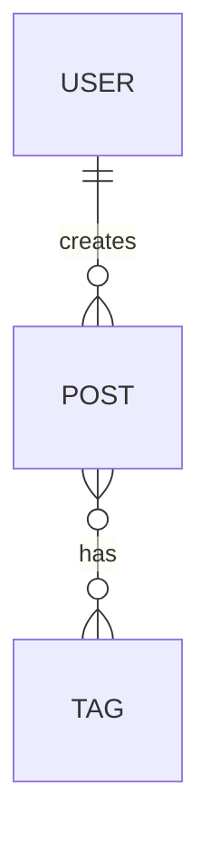

# Модель данных и интерфейсы

> Какие данные хранит система, как они связаны, и как компоненты общаются друг с другом.

---

## Модель данных

### Сущности

Перечисли основные объекты системы.

#### [Сущность 1 — например: User]

| Поле | Тип | Обязательное | Описание |
|------|-----|:---:|---------|
| `id` | UUID / int | ✓ | Первичный ключ |
| `email` | string | ✓ | Уникальный |
| `password_hash` | string | ✓ | bcrypt |
| `created_at` | timestamp | ✓ | |
| `...` | ... | | |

#### [Сущность 2]

| Поле | Тип | Обязательное | Описание |
|------|-----|:---:|---------|
| `id` | | ✓ | |
| `...` | | | |

### Связи между сущностями

```
User 1──* Post        (один пользователь, много постов)
Post *──* Tag         (пост может иметь много тегов)
User 1──1 Profile     (один к одному)
```

<!-- Mermaid ER диаграмма:

-->

---

## API интерфейс

> Заполни если есть REST API, gRPC, или любой другой межсервисный интерфейс.

### Базовый URL

```
http://localhost:8000/api/v1
```

### Аутентификация

```
Authorization: Bearer <token>
```

### Эндпоинты

#### [Модуль — например: Auth]

```
POST /auth/register
POST /auth/login
POST /auth/logout
POST /auth/refresh
```

**POST /auth/login**

Request:
```json
{
  "email": "user@example.com",
  "password": "..."
}
```

Response 200:
```json
{
  "access_token": "...",
  "refresh_token": "...",
  "expires_in": 86400
}
```

Response 401:
```json
{
  "error": "invalid_credentials"
}
```

#### [Следующий модуль]

```
GET    /resource          # список
POST   /resource          # создать
GET    /resource/:id      # получить
PUT    /resource/:id      # обновить полностью
PATCH  /resource/:id      # обновить частично
DELETE /resource/:id      # удалить
```

---

## Внутренние интерфейсы

> Если у тебя несколько сервисов или модулей — как они общаются между собой?

| От кого | К кому | Протокол | Что передаёт |
|---------|--------|----------|-------------|
| API | Worker | Redis Queue | Job объект |
| ... | ... | ... | ... |

---

## Хранилище

| Что хранится | Где | Почему |
|-------------|-----|--------|
| Основные данные | PostgreSQL | Реляционные данные с транзакциями |
| Сессии / кэш | Redis | Быстрый доступ, TTL |
| Файлы | S3 / локально | ... |
| Логи | stdout / файл | ... |

---

## Чеклист

- [ ] Все сущности имеют первичный ключ?
- [ ] Связи между сущностями определены?
- [ ] API покрывает все функциональные требования?
- [ ] Форматы ошибок консистентны?
- [ ] Чувствительные данные не возвращаются в ответах API?
